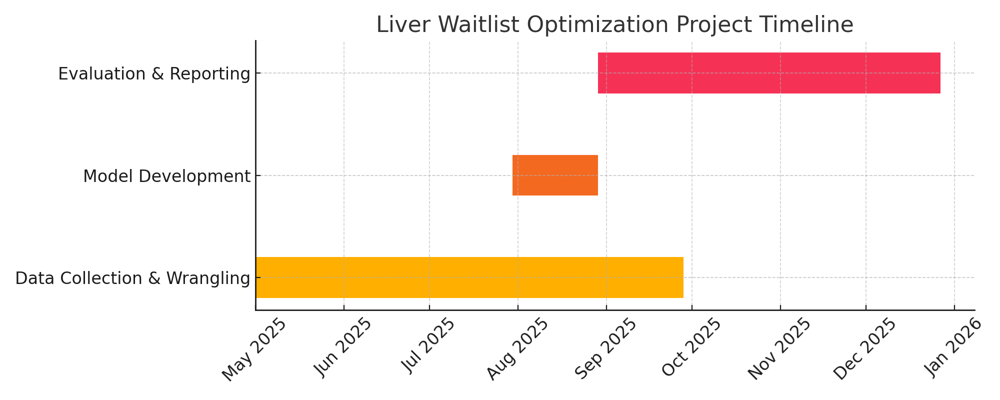

# Optimization Proposal

**Focus:** Liver Waitlist Prioritization

*Prepared by: Ayana Andrews-Joseph, MDA, MPH*

## Introduction

Currently, liver waitlist (LWL) placement is guided by a first-come, first-served system, supported by clinical judgment and emotionally driven decision-making. While data plays a role, decisions are often made without incorporating structured optimization. Introducing a new, objective dimension to this process could produce a synergistic effect—where the combination of data-driven modeling and clinical insight yields better outcomes than either could alone.

The primary goal of this optimization proposal is to maximize the positive outcomes experienced by the organization’s liver transplant patients. Specifically, the aim is to reduce waitlist mortality and improve post-transplant success through better prioritization strategies.

## Background and Rationale

Solid organ transplantation is a service provided to human individuals, each with unique histories and challenges. Patient A’s transplant journey may be vastly different from Patient B’s, but both are required to meet critical pre-transplant milestones before being eligible for listing. Optimizing the timing of listing, based on a patient’s readiness and clinical trajectory, increases the chances of a successful donor match and a favorable outcome.

Deceased-donor livers vary widely in quality. When competition is high among transplant centers, marginal livers—those of lower quality or with increased risk—are more likely to be accepted and used, and less likely to be discarded. However, these marginal livers also introduce added complexity. For example, liver viability and transplant success rates decline as a function of **cold ischemia time**—the time the liver is preserved outside the body. Despite rapid transportation protocols, **geographic constraints** in organ allocation remain unavoidable and must be factored into decision-making.

Other non-clinical factors—such as insurance approval, psychological evaluation, and nutritional assessments—also impact listing readiness. Some patients are approved for listing pending the completion of their “work-up,” while others may be listed prematurely and later removed due to unforeseen complications.

A structured prioritization system—paired with the patient’s MELD (Model for End-Stage Liver Disease) score—could help clinical teams identify the most urgent and most ready patients. MELD already accounts for the likelihood of death within 90 days. If a patient has a low probability of dying in that window, it may be appropriate to prioritize another individual with higher clinical urgency or readiness. This approach also helps account for **rapidly declining patients**, whose limited time requires swift intervention, as well as patients facing significant barriers to evaluation.

## Proposal Overview

The organization has a significant opportunity to apply optimization modeling to enhance liver waitlist placement, just as the Organ Procurement and Transplantation Network (OPTN) did to address disparities in U.S. liver allocation. Their effective optimization **reduced geographic disparity in liver offers**, ending the era colloquially known as the “liver wars.” This historical precedent affirms the national impact that optimization can have within the transplant domain.

Our proposal mirrors that success by introducing an optimization-based model tailored to the center’s unique patient population and operational constraints. Implementation will require the formation of a **multi-disciplinary team** sourced both internally and externally. Within the organization, stakeholders may include clinicians, transplant coordinators, data scientists, and analysts. In parallel, **external collaborators**—including university faculty and graduate students—can be engaged to support modeling efforts while fulfilling academic or internship requirements through real-world application.

## Technical Approach

The proposed model will incorporate multiple patient-specific features to identify and optimize waitlist prioritization. While MELD remains a core component, this model will also assess:

- **Readiness indicators**: including completion of psychological evaluations, nutritional status, and insurance clearance

- **Risk-of-decline variables**: capturing medical fragility and risk of acute decompensation

- **Geographic constraints**: factoring in regional allocation challenges and cold ischemia time

- **Donor quality matching**: considering organ viability and institutional tolerance for marginal liver utilization

The model will be developed using a **mathematical programming solver** (e.g., linear or integer programming), designed to generate optimized prioritization scores or recommendations. Output can be reviewed alongside traditional MELD-based triage and presented to transplant committees to support placement decisions.

## Timeline & Project Management

Implementation of this project will span **9 to 12 months**, depending on resource availability, data access, and institutional alignment. The following phased approach is recommended:

### Phase 1: Data Collection & Wrangling (3–6 months)

- ELT | ETL features from legacy and current EHR systems

- Standardize data formats and resolve integration issues caused by the recent system migrations

- Collaborate with IT and clinical informatics to access historical patient records, transplant outcomes, and pre-listing indicators

### Phase 2: Model Development & Solver Integration (1 month)

- Define the objective function and constraints based on clinical inputs and stakeholder priorities

- Select an appropriate mathematical programming solver

- Prototype the optimization model using real-world data

### Phase 3: Impact Evaluation & Refinement (2–4 months)

- Run retrospective simulations to validate model effectiveness using historical transplant data

- Compare model-driven prioritization recommendations against actual listing decisions and outcomes

- Adjust model weights or features based on feedback from clinical and administrative teams

🕒 **Total Estimated Timeline**: 9–12 months

#### Figure: Proposed Timeline for Project Implementation

>Note: The timeline may vary based on the organization’s recent EHR migration and data readiness.

## 🛠️ Tools & Technologies

To ensure transparency, reproducibility, and integration into existing systems, the following tools and libraries are recommended:

| Purpose | Tools & Technologies |
| :---- | :---- |
| **Project Collaboration** | Google Drive, GitHub (private repo), Google Docs, Slack, shared Google Sheets |
| **EHR Data Access & ELT/ETL Pipelines** | Secure APIs, HL7/FHIR standards, Cerner/Epic export tools, Python (`pyhealth`, `fhirclient`) |
| **Data Wrangling** | Python (`pandas`, `numpy`), SQL, IBM Cognos, PostgreSQL |
| **Exploratory & Confirmatory Data Analysis (EDA/CDA)** | Python (`pandas`, `numpy`, `scipy`), R (`ggplot2`, `dplyr`, `broom`), Jupyter Notebooks, Power BI |
| **Statistical Modeling & Hypothesis Testing** | R (`stats`, `car`, `lme4`), Python (`statsmodels`, `scikit-learn`), Excel (Data Analysis ToolPak) |
| **Data Visualization** | Python (`matplotlib`, `seaborn`, `plotly`), R (`ggplot2`, `plotly`), Power BI, Tableau |
| **Optimization Modeling** | PuLP (prototype ranking logic), OR-Tools (routing/logistics), Gurobi (academic use), CPLEX (check with IT for access) |

## Evaluation Metrics

Impact will be assessed using a combination of established and custom performance indicators, including:

- **Waitlist Mortality Rate**: Before vs. after model use

- **Time to Match**: Days from listing to transplant

- **Marginal Liver Utilization**: % change in discarded vs. transplanted livers

- **Equity Measures**: Geographic disparities, insurance delays, demographic breakdowns

- **MELD Score Alignment**: Comparison of MELD-only vs. optimized prioritization outcomes

Key benchmarks will align with those maintained by the **Scientific Registry of Transplant Recipients (SRTR)**, enabling compatibility with national-level reporting and accreditation.

## Summary & Next Steps

This proposal offers a strategic, data-driven solution to enhance liver transplant waitlist prioritization. By applying operations research principles, we can support clinicians with better insights, reduce mortality, and improve the allocation of life-saving resources.

This is not just a modeling exercise—it’s a blueprint for **real-world clinical impact**. With the right interdisciplinary team, institutional support, and academic partnership, the organization can take a meaningful step forward in transplant optimization and equity.

### ✅ Immediate Next Steps:

1. Confirm internal stakeholders for collaboration (Clinical, Data Science, IT)

2. Request access to post-EHR-migration data environments

3. Identify faculty or graduate programs for academic collaboration

4. Begin preliminary data inventory and model architecture mapping

---

**Prepared by:**  
**Ayana Andrews-Joseph**  
Data Analyst  
*Bridging patient outcomes with systems design*  
*Edit Assistance w/AI*

[GitHub: AyanaAtWork](https://github.com/ayanas-git/AyanaAtWork)

---

### 📁 Repository Tags

`#healthcare-optimization` `#transplant #modeling` `#waitlist` `#causalinference` `#clinicalinformatics` `#operationsresearch`

---

### **⚙️ Optimization Tools for This Project: Use-Case Cheat Sheet**

| Tool | Use-Case in This Project | Notes / Tips |
| :---- | :---- | :---- |
| **PuLP** | Use to **build and solve basic prioritization models** in Python (e.g., ranking patients under constraints) | Great for beginners, works with free solvers like CBC |
| **OR-Tools** | Use when dealing with **matching constraints** like cold ischemia \+ geography or routing marginal livers fast | Developed by Google, good for logistics-style models |
| **Gurobi** | Use to **solve larger, more complex versions** of your model with many patients and constraints | Requires an **Academic** or **Enterprise** License |
| **CPLEX** | Use if your institution provides it — for **hospital-grade optimization** across large-scale decision pipelines | Check with IT or the research division for access (common in healthcare settings) |

