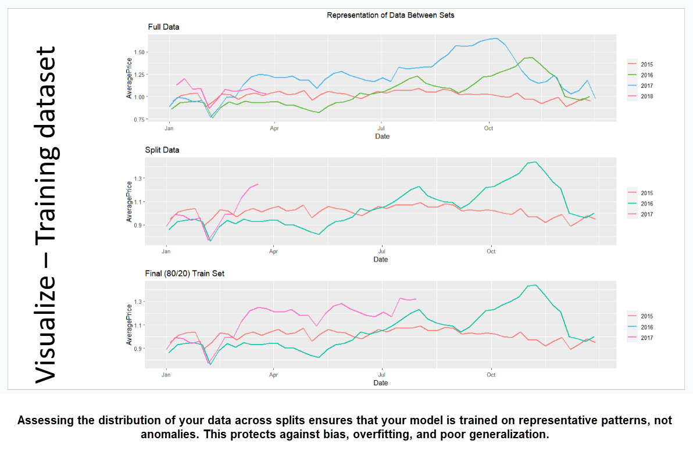

<!--markdownlint-disable MD033-->

# 🧠 Visual Assessment of the Training Dataset

Exploratory Data Analysis and Confirmatory Data Analysis are essential steps in the data science process. They help you understand the data, identify patterns, and ensure that your training set is representative of the overall dataset.

This is particularly important when working with time series data, where the distribution of data points can change over time. In this case, we are looking at a dataset of historical average prices for a specific product.

Assessing your data splits visually ensures your training set is representative, not skewed. This helps avoid bias, overfitting, and inaccurate generalization of the model, increasing the likelihood of success in real-world applications.

✅ **Visual check = sanity check.** (see image below)

## When do you need to visualize your data?

Before diving into modeling, it’s critical to visualize not just the **full dataset**, but also your **training and test splits**. The visualization above breaks it down into three views:

- **Full Data**: The raw historical average price across multiple years  
- **Split Data**: A closer look at how slicing changes representation  
- **Final Train Set (80/20)**: The training data used for modeling

Each subset carries forward — or potentially **loses** — key patterns from the original data.

### Main Takeaways

- **The 80/20 Split**: The training set is 80% of the data, while the test set is 20%. This split is common in machine learning to ensure that the model can generalize well to unseen data.

- **Full Data**: Provides a comprehensive view of the dataset, including trends and seasonality.

- **Split Data**: Shows how the data is divided into training and test sets, which can affect model performance.

- **Final Train Set**: The final training set used for modeling, which should be representative of the full dataset.

----

#### Figure Description:  

Using _Exploratory_ Data Analysis **(EDA)**  and _Confirmatory_ Data Analysis **(CDA)** to assess training dataset

